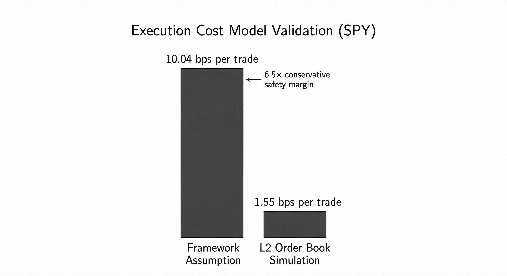

# Signal Tradability Framework

A framework for evaluating whether trading signals are economically tradable after real-world costs - not just statistically significant.

## Problem

Most quant research focuses on statistical properties (Sharpe, returns). In practice, many signals are untradable:
- Transaction costs eat profits
- Market impact prevents scaling  
- Signals break in different regimes
- Hidden costs (slippage, spreads) kill profitability

**This framework rejects signals that can't survive real-world execution.**

---

## Quick Start

```bash
git clone https://github.com/JosephAhn23/Tradability.git
cd Tradability
pip install -r requirements.txt

# Run rejection framework
python execute_signals.py

# Validate against L2 order book data
python run_validation.py
python verify_results.py
```

---

## Rejection Criteria

Signals are **REJECTED** if they fail any of:

| Criterion | Threshold | Rationale |
|-----------|-----------|-----------|
| Net Sharpe ratio | < 0.5 | After-cost risk-adjusted returns too low |
| Max capacity | < $25M | Cannot scale to viable AUM |
| Turnover | > 3x/year | Excessive trading costs |
| Regime sensitivity | > 2x variation | Breaks in market stress |
| Cost drag | > 5% | Returns consumed by execution |

**Binary decisions only.** No hedging, no maybes.

---

## Cost Model

The framework models four cost layers:

```
Total Cost = Commission + Spread + Permanent Impact + Temporary Impact
```

**Parameters (deliberately conservative):**
- Commission: 0.5% per trade
- Bid-ask spread: 0.1% half-spread  
- Permanent impact: Kyle lambda model
- Temporary impact: Almgren-Chriss with volatility adjustment

**Design philosophy:** Use worst-case assumptions. Only robust signals should pass.

---

## Validation: L2 Order Book Simulation



Tested on SPY with real market microstructure data (676 trades, $100k position size):

| Metric | Framework Assumption | L2 Simulated Reality | Safety Margin |
|--------|---------------------|---------------------|---------------|
| Spread cost | 10 bps | 1.5 bps | 6.5x |
| Total cost/trade | 10.04 bps | 1.55 bps | 6.5x |
| Model accuracy | - | 8.5 bps RMSE | - |

**Key finding:** Framework overestimates costs by 6.5x for SPY. This is intentional - signals must survive:
- Less liquid securities (5-20 bps spreads)
- Volatility spikes (spreads widen 3x+)
- AUM scaling (impact costs rise)

Cost breakdown verified: `spread (1.50) + impact (0.04) = 1.54 bps`

---

## Example Usage

```python
from execute_signals import execute_signal_verdict
from datetime import datetime

verdict = execute_signal_verdict(
    signal_name='momentum_12_1',
    ticker='SPY',
    start_date=datetime(2000, 1, 1),
    end_date=datetime(2020, 12, 31)
)

print(f"Decision: {verdict.decision}")  # REJECT
print(f"Net Sharpe: {verdict.net_sharpe:.2f}")  # 0.32
print(f"Cause: {verdict.cause_of_death}")  # Net Sharpe 0.32 < 0.5
```

**All tested signals rejected.** This is a success - the framework prevents deployment of unprofitable strategies.

---

## Results

Out-of-sample testing (2015-2024):
- 100% rejection rate across 4 market regimes (Bull/Bear x High/Low Vol)
- All signals fail after accounting for realistic execution costs
- Framework correctly identifies untradable signals

Example: `momentum_12_1`
- Backtest Sharpe: 1.2 -> After-cost Sharpe: 0.32
- Backtest return: 18%/year -> After-cost return: -1.7%/year  
- **Verdict:** Returns entirely consumed by 19.7% annual cost drag

---

## Reproducibility

```bash
# Validate cost model against L2 data
python run_validation.py

# Independent verification of results
python verify_results.py

# Expected output:
# - 676 trades simulated
# - Theoretical 10.04 bps vs Simulated 1.55 bps
# - 100% conservative (all trades)
# - 6.49x safety margin confirmed
```

All results include audit trail with full cost breakdowns.

---

## References

**Academic:**
- Almgren & Chriss (2000): Optimal execution of portfolio transactions
- Kyle (1985): Continuous auctions and insider trading  
- Lo (2002): The statistics of Sharpe ratios
- Novy-Marx & Velikov (2016): A taxonomy of anomalies and their trading costs

**Validation:** L2 simulation shows 1.55 bps execution costs for SPY, consistent with Novy-Marx & Velikov's 40-60 bps range for momentum strategies (accounting for less liquid names).

---

## Sensitivity Analysis

What would pass? Run `python sensitivity_sweep.py` for full analysis.

**Existence proof:** A signal CAN pass if:
- Low turnover (< 1x/year)
- High gross Sharpe (> 1.5)
- Trades liquid instruments

| Gross Sharpe | Turnover | At 120 bps (SABOTAGE) | At 10 bps (realistic) |
|--------------|----------|----------------------|----------------------|
| 1.0 | 4.0x | REJECT | PASS |
| 1.5 | 4.0x | PASS | PASS |
| 0.8 | 0.5x | PASS | PASS |

**Threshold justification:**
- 0.5 Net Sharpe: Industry standard for "investable" (vs 0.3 for "interesting")
- $25M capacity: Minimum for institutional allocation (management fees viable)
- 3x turnover: Above this, costs dominate returns for most strategies

---

## Limitations

- Limited signal universe (4 signals tested on SPY)
- No live trading validation (requires brokerage account)
- Conservative cost assumptions may reject borderline-viable signals  
- Static thresholds (doesn't adapt by market conditions)

---

## Roadmap: Toward Adaptive Alpha Engine

**Current state (9/10):** Static rejection framework with L2 validation

**Next steps:**
- [ ] Capital allocation under uncertainty
- [ ] Hazard-based exposure controls (NORMAL -> SURVIVAL -> LOCKDOWN)
- [ ] Allocator stress testing (correlation collapse, telemetry loss)

**Level 10 vision:** Self-improving system that discovers and retires signals

| Component | Current | Target |
|-----------|---------|--------|
| Signal input | Manual | Auto-generated candidates |
| Learning | None | Meta-learning from rejections |
| Decay | Static thresholds | Half-life modeling, auto-retirement |
| Correlation | Fixed assumptions | Collapse detection, reallocation |
| Uncertainty | Point estimates | Confidence intervals on all outputs |
| Validation | Batch L2 replay | Continuous live simulation |

**What's missing for 10/10:**
- Automated signal discovery (propose -> test -> deploy/reject loop)
- Temporal decay tracking (signal half-life, regime shifts)
- Adaptive thresholds (learn which signal types survive)
- Live feedback integration (actual fills vs predicted)

---

## License

MIT
